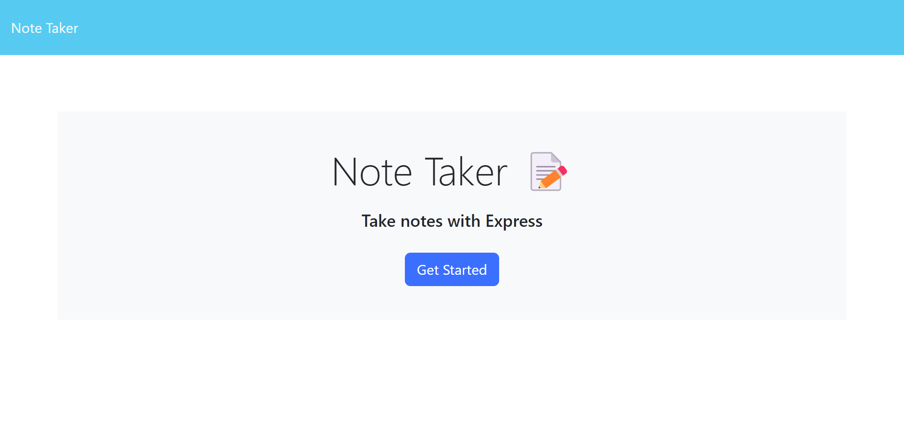
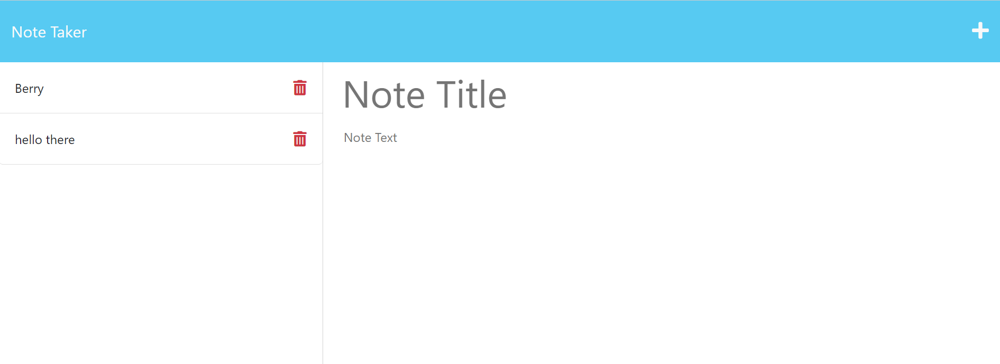
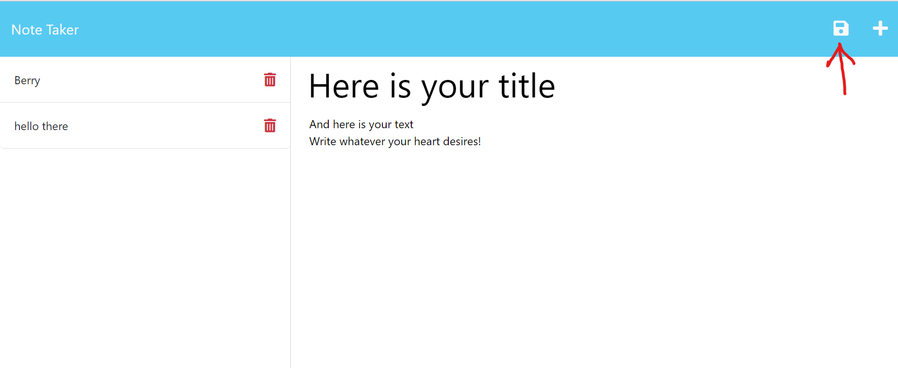
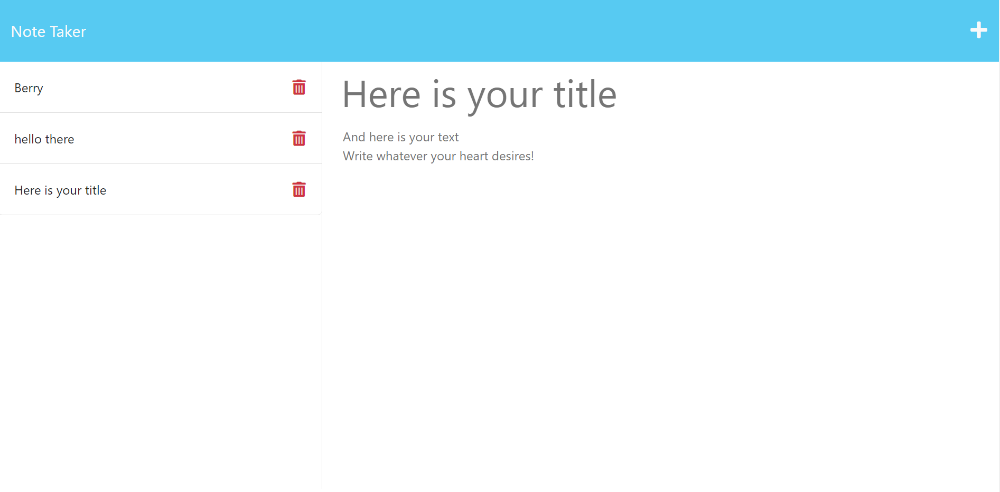
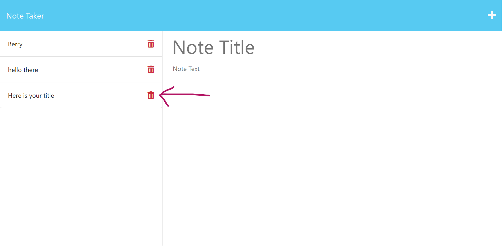

# Note Taking Application

## Description
This project was developed for the purpose of providing users an easy way to write and save notes, and to access stored notes. This is accomplished by running an html page containing an input form, which allows the user to input the title and text content of their note.

Once they submit their note, its contents are routed to an internal database via a POST request to a server. The website, by continuously running GET requests to the server, then accesses and displays all notes saved to the server to the left of the input form. Users are also able to delete the notes they have previously saved, if they wish to clear up notes they feel they no longer need.

## Usage
On the main webpage, click the button labeled "Get Started". This will take you to the note taking application. 

There, you will see the titles of previously saved notes arranged in a list on the left side of the page. Click on a title to view its note's text content. To write a new note, click the plus sign icon at the top left of the page. Then, type the title you wish to give it into the text entry box labeled "Note Title." Then, enter the contents of your note into the box labeled "Note Text".

Once you have finished writing your note, click on the save icon found on the top right of your page.

The title of your new note will appear in the list of saved notes.

If you wish to delete any notes, click on the red trash icon located to the right of the note's title.

## Credits
The code for this project's index.html, notes.html, index.js, and styles.css files was obtained by cloning the source code from this repository: https://github.com/coding-boot-camp/miniature-eureka

The GET and POST server requests were written by following this tutorial: https://expressjs.com/en/guide/routing.html

The DELETE server request was written by following this tutorial: https://www.tabnine.com/code/javascript/functions/express/Express/delete

## Webpage
Access the webpage here: https://lets-take-notes-02a55b7f0edb.herokuapp.com
